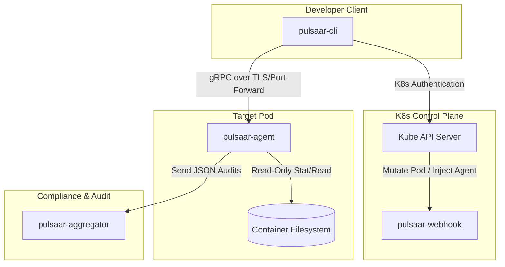

# Pulsaar

<p align="center">
  
</p>

<p align="center">
  <strong>Production-Safe, Auditable, Read-Only File Exploration for Kubernetes Pods</strong>
</p>

<p align="center">
  <a href="https://github.com/VrushankPatel/pulsaar/actions/workflows/ci.yml"></a>
  <a href="https://codecov.io/gh/VrushankPatel/pulsaar"></a>
  <a href="https://goreportcard.com/report/github.com/VrushankPatel/pulsaar"></a>
  <a href="https://github.com/VrushankPatel/pulsaar/releases"></a>
  <a href="https://github.com/VrushankPatel/pulsaar/pkgs/container/pulsaar-agent"></a>
  <a href="https://opensource.org/licenses/Apache-2.0"></a>
</p>

---

## 🌟 Overview

**Pulsaar** solves the security challenge of inspecting container filesystems in production environments. It provides developers with safe, read-only access to troubleshoot issues without requiring `kubectl exec`, interactive shells, or elevated cluster privileges.

### Why Pulsaar?
* **Zero Executive Footprint**: Eliminates interactive root shell risks inside live production environments.
* **Granular Access Control**: Lock down exploration to specific folders (e.g., only `/var/log` or `/app/config`).
* **Compliance-Ready**: Every list, read, or stat attempt is audited and sent to a central logging aggregator.

---

## 📐 Architecture

Pulsaar consists of a client CLI, a mutating webhook for sidecar injection, a lightweight gRPC agent (deployed as a sidecar or injected as an ephemeral container), and an audit logging aggregator.



---

## 🚀 Key Features

| Feature | Description | Benefit |
| :--- | :--- | :--- |
| **Read-Only Safety** | Enforces read-only filesystem calls (List, Read, Stat) at the API layer. | Prevent accidental data loss or config editing. |
| **mTLS Encryption** | End-to-end encryption with dynamically generated TLS keypairs. | Secure data transit over the cluster network. |
| **RBAC Integration** | Interacts with K8s SubjectAccessReview to enforce pod permissions. | Reuses existing Kubernetes namespace RBAC rules. |
| **Flexible Sidecar / Ephemeral** | Deploy as a permanent sidecar or inject on-demand via Ephemeral Containers. | Zero-overhead when not troubleshooting. |

---

## 📦 Installation

### 1. Install the CLI Tool

Download the pre-compiled binary for your system from the [Releases Page](https://github.com/VrushankPatel/pulsaar/releases) or install via Homebrew:

```bash
# Tap the Homebrew repository
brew tap VrushankPatel/homebrew-pulsaar

# Install the Pulsaar CLI client
brew install pulsaar-cli
```

### 2. Deploy Pulsaar to your Cluster

Install the Pulsaar Webhook, Agent templates, and central Audit Aggregator via Helm:

```bash
# Add the Pulsaar repository
helm repo add pulsaar https://vrushankpatel.github.io/pulsaar

# Install the Helm chart
helm install pulsaar pulsaar/pulsaar \
  --namespace pulsaar-system \
  --create-namespace
```

---

## 💡 Usage Guide

Once installed, use the CLI client to explore files inside any pod you have read access to.

### Explore Directories
List files and subdirectories within allowed roots:
```bash
pulsaar explore --pod my-production-pod -n default --path /var/log
```

### Read File Contents
Retrieve contents of text configuration files safely (up to 1MB size limit):
```bash
pulsaar read --pod my-production-pod -n default --path /app/config/settings.json
```

### Get Path Metadata
Retrieve metadata (size, permissions, modification times) for any file or directory:
```bash
pulsaar stat --pod my-production-pod -n default --path /tmp/app.lock
```

### Check Agent Health
Check connection state and health details of the agent inside the pod:
```bash
pulsaar health --pod my-production-pod -n default
```

### Interactive TUI Explorer
Launch a gorgeous K9s-style interactive Terminal User Interface to select namespaces, pods, and explore/view files interactively:
```bash
pulsaar tui
```

### Manage Pod Denylists
Explicitly block specific directories (e.g. secret files) on a pod from the CLI:
```bash
pulsaar config set-denylist --pod my-production-pod -n default --paths /app/certs,/app/.env
```

---

## ⚙️ Configuration & Annotations

Secure pod access by configuring standard annotations in your Pod specifications:

```yaml
apiVersion: v1
kind: Pod
metadata:
  name: my-app
  namespace: default
  annotations:
    # Trigger automatic sidecar injection
    pulsaar.io/inject: "true"
    # Define directories developers are allowed to inspect
    pulsaar.io/allowed-roots: "/var/log,/app/config"
    # Define directories developers are explicitly forbidden from inspecting
    pulsaar.io/denied-paths: "/app/config/secrets.json"
spec:
  containers:
  - name: app
    image: my-app:latest
```

---

## 🔒 Security & Compliance

Pulsaar is designed to meet strict enterprise compliance frameworks:
1. **Audit logs**: Logged locally and aggregated at `pulsaar-aggregator`. Failures in logging block the gRPC action.
2. **Access Control**: Developer credentials are validated via Kubernetes TokenReviews & SubjectAccessReviews against the namespace's `get pods` verb.
3. For reporting security vulnerabilities, please refer to our [Security Policy](SECURITY.md).

---

## 🤝 Contributing

We welcome contributions from the community! Please read our [Contribution Guidelines](CONTRIBUTING.md) and [Code of Conduct](CODE_OF_CONDUCT.md) before submitting a Pull Request.

---

## 📄 License

Pulsaar is licensed under the Apache 2.0 License. See the [LICENSE](LICENSE) file for details.